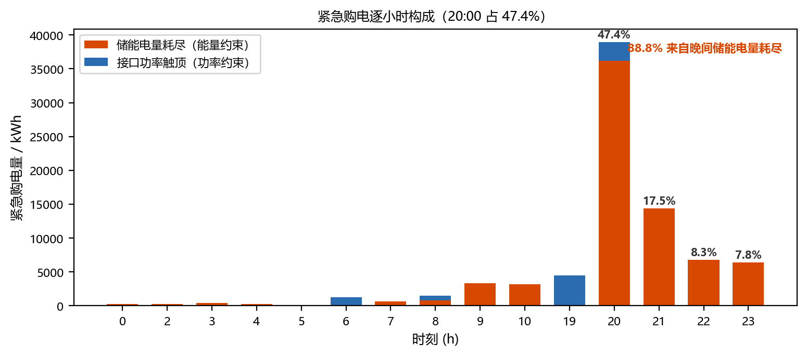

# 问题三补充检验与历史诊断

本文档承接正文压缩后移出的背景材料。短期对照及旧方案诊断来源为论文仓库提交 `38a52feaf083a144c4b74986ffeaea0086c81196` 的 `sections/q3.tex`；后补的预测实现细节、全年消融及版本比较来源为 `511da45c947316c10054c842f3f3102af2a497ef` 的同一文件。数值均为既有记录，本次未重新运行实验。

## 短期完美信息对照

原稿阶段 1 的日期范围为 2025 年 2 月 1—14 日：

| 方案 | 总购电费用/元 |
|---|---:|
| 完美信息 LP（使用实测净负荷） | 587,989.94 |
| 该阶段 LA | 635,814.01 |
| 同期 N0 | 654,938.05 |

该阶段 LA 比完美信息 LP 高约 8.1%。这一结果用于说明短期预测决策与完美信息对照的差距，不替代正文 334 天的正式策略对比，也不据此将全部差距归因于预测误差。

## 旧方案失效诊断

诊断对象为旧的 24 h 展望加 β 余量方案：原稿记录紧急购电的 88.8% 与晚间储能电量耗尽相关，20:00—21:00 时段占紧急购电量的 47.4%，日末储电量有 106 天贴近 1200 kWh 下限。这些统计解释了延长展望时间及在优化阶段修正电量预算的动机。

图源为原正文 `fig:q3_emergency`，保留原图文件。88.8%、47.4% 和 106 天均对应旧方案，不作为最终 LA 策略的统计值；历史机制对照见下表，正式效果以正文策略对照表为准。

## 预测实现细节

附件 3 每次给出发布后第 1 至第 24 小时的整点光伏预报。将发布时点记为横坐标 0，整点预报对应 1 至 24，起点取发布前最后一个已完成 10 分钟时段的实测光伏，按 10 分钟粒度线性插值并截断负值。该设置保留夏季 6:00、18:00 附近非零的实际出力；0:00 起点取前一日末段。

负荷点预测沿用问题二的因果 Expanding XGBoost，特征包括星期、月份、年内日序，滞后 1/2/7 日及 3/7/30 日均值；训练仅使用目标日之前的数据，样本不足时退回上周同星期几。日内比例校正使用当天已完成时段的实测均值与同时段 0:00 预报均值之比，不重新引入未来实测值。原稿记录比例校正优于日内重训的诊断判断；由于该段未列定量证据，正文精简后仅陈述实际采用的方法。

## 全年历史消融

下表原样保留旧稿的八组结果，差额列均相对于表内的旧 24 h 加 β 基准。它们属于历史实验口径；正式回放已统一改为 2 月 1 日初始储电量 6000 kWh，不能将历史费用作为当前方案的正式费用，也不能将跨初值的差额单独归因于某一参数。

| 历史变体 | 总费用/元 | 较旧基准/元 | 紧急购电/kWh | 日末贴底天数 |
|---|---:|---:|---:|---:|
| 24 h + β（旧基准） | 13,458,730.30 | 0 | 82,228.36 | 106 |
| 48 h + β | 13,421,219.84 | −37,510.46 | 70,433.46 | 0 |
| 24 h + q_L=0.70 | 13,338,687.71 | −120,042.59 | 30,313.53 | 22 |
| 24 h + q_L=0.65 | 13,294,093.95 | −164,636.35 | 44,783.43 | 37 |
| 48 h + q_L=0.60 | 13,274,667.54 | −184,062.76 | 58,355.20 | 1 |
| 48 h + q_L=0.65 | 13,263,910.99 | −194,819.31 | 39,678.65 | 1 |
| 48 h + q_L=0.70 | 13,308,698.92 | −150,031.38 | 26,711.59 | 1 |
| 48 h + q_L=0.75 | 13,402,722.60 | −56,007.70 | 17,308.57 | 0 |

在原历史实验的对照范围内，单独延长展望时间减少费用 37,510.46 元；24 h 下改用 q_L=0.65 的分源修正减少费用 164,636.35 元；该分位下再延长展望时间减少约 3.0 万元。原网格的最低费用对应 q_L=0.65，作为全年诊断保留，不参与正式参数选择。正式 q_L=0.60 来自 1 月 15—31 日标定，完整七组标定评分仍列于正文。

## 费用版本与初值口径

上述 48 h、q_L=0.60 的 13,274,667.54 元来自一月储电量滚入二月的旧回放。建模仓库 `planning/Q3_notes.md` 记录该版本 2 月 1 日初始储电量为 8377.37 kWh；将正式初值改为 6000 kWh 后，当前 LA 总费用为 **13,275,795.85 元**。

旧稿还比较了当前正式费用与历史 q_L=0.65 的 13,263,910.99 元，差额为 11,884.86 元（约 0.09%）。这同时涉及参数与初值口径，不作为单独改变 q_L 的效应。正文只保留正式费用及同口径候选策略的对照。

## 核验范围

正式结果的独立导出检查覆盖 334 天、每日 144 个时段的非负购电、模板列序、费用复算、电量平衡、SOC 上下界、接口功率上限及跨日连续性；2 月 1 日初始储电量为 6000 kWh。决策信息检查要求仅使用各发布时点已经获得的预测与实测信息。

历史诊断与短期对照保留作可追溯材料；正式参数仍采用一月标定的 q_L=0.60，模型代码、结果工作簿及正文结果表均未因本次文字精简而更改。
